# Diagrammes - Central Park IoT

Ce fichier regroupe les diagrammes utiles pour la presentation et le cahier des charges. Les diagrammes sont ecrits en Mermaid pour etre faciles a copier, modifier et exporter en image.

## 1. Diagramme Bloc Simple

Utilise ce diagramme dans la presentation. Il est simple et facile a comprendre.

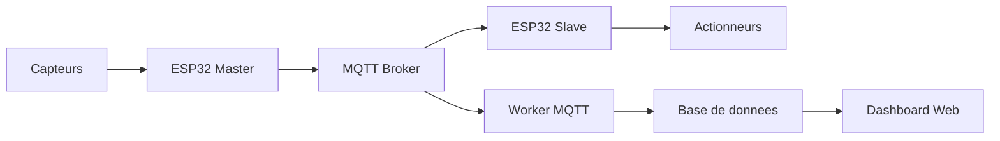

Version texte si Mermaid n'est pas accepte :

```text
Capteurs -> ESP32 Master -> MQTT Broker -> ESP32 Slave -> Actionneurs
                                |
                                v
                         Worker MQTT -> Base de donnees -> Dashboard Web
```

## 2. Architecture IoT Complete

Ce diagramme montre le lien entre le monde physique et le monde numerique.

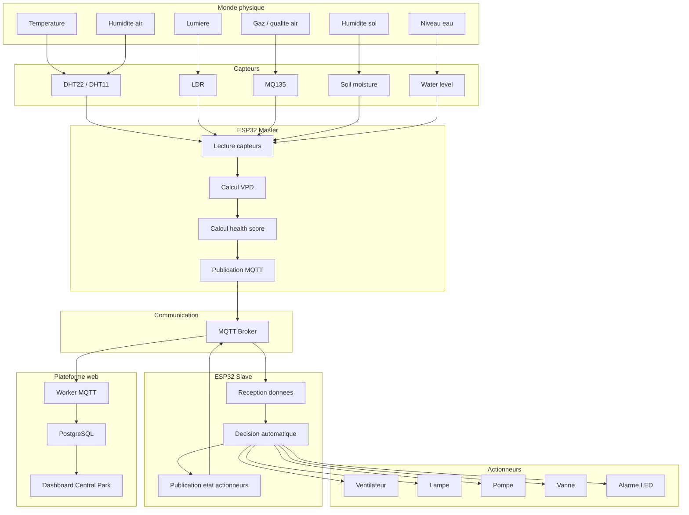

## 3. Diagramme Master / Slave

Ce diagramme explique pourquoi il y a deux ESP32.

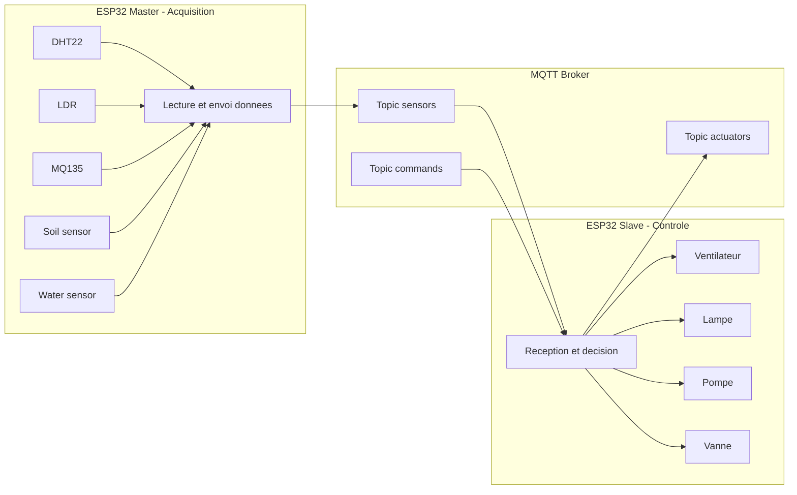

## 4. Diagramme Des Topics MQTT

Ce diagramme montre les messages MQTT utilises.

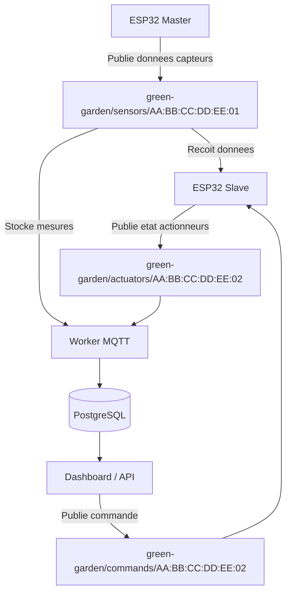

## 5. Flux Des Donnees Capteurs

Ce diagramme montre comment une valeur capteur arrive jusqu'au dashboard.

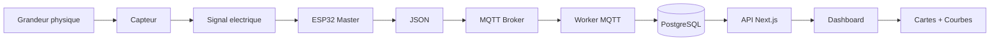

## 6. Flux De Controle Des Actionneurs

Ce diagramme montre comment le systeme agit sur la serre.

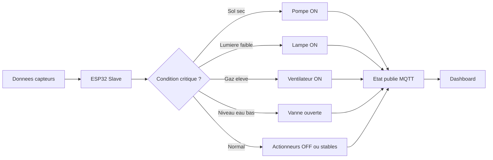

## 7. Logique Automatique

Ce diagramme est tres utile pour expliquer la partie controle.

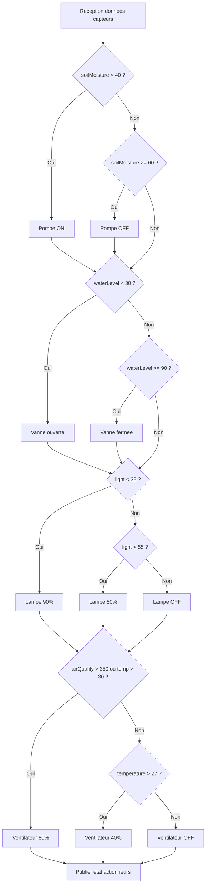

## 8. Diagramme De Sequence - Fonctionnement Normal

Ce diagramme montre l'ordre des actions pendant l'execution.

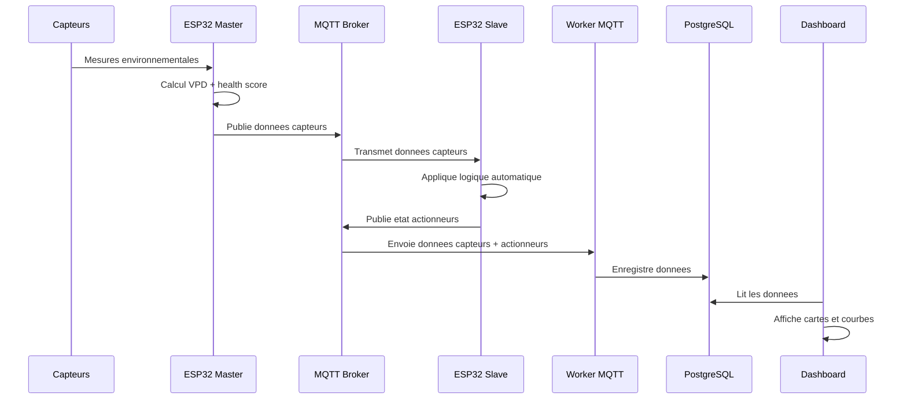

## 9. Diagramme De Sequence - Commande Manuelle

Utilise ce diagramme seulement si tu parles du controle manuel.

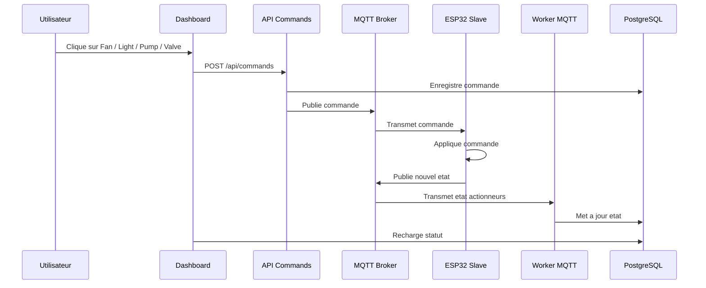

## 10. Diagramme De Cas D'utilisation

Ce diagramme montre ce que l'utilisateur peut faire.

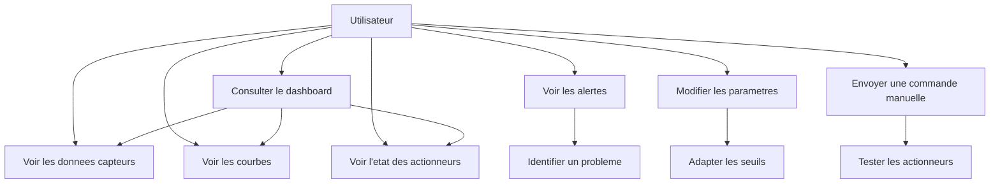

## 11. Diagramme De Base De Donnees

Ce diagramme explique les tables principales.

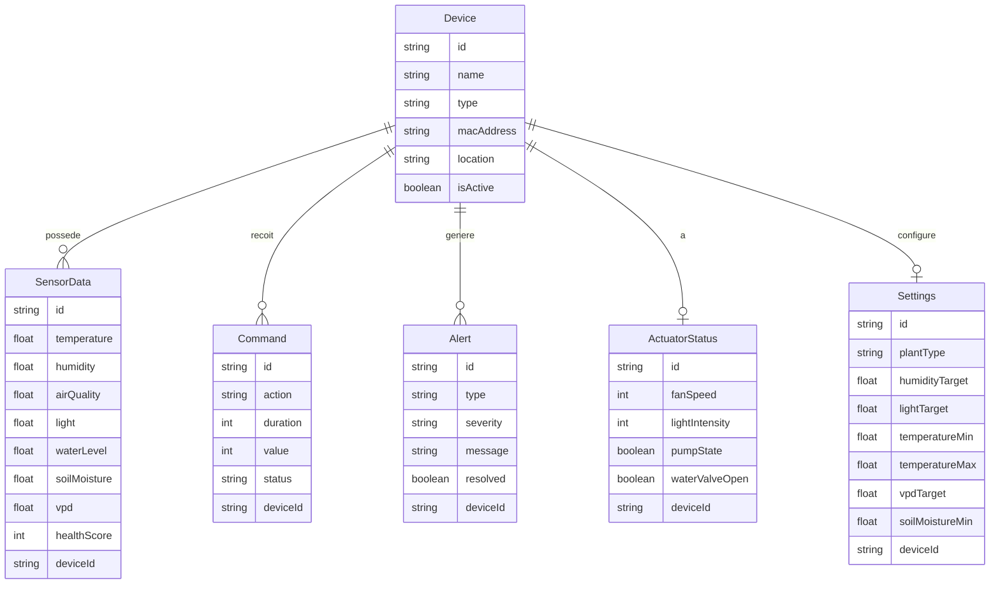

## 12. Diagramme Dashboard

Ce diagramme montre ce que contient l'interface web.

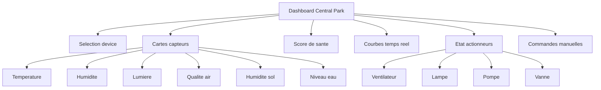

## 13. Diagramme De Demonstration

Ce diagramme resume le scenario a montrer pendant la soutenance.

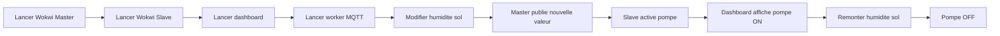

## 14. Diagramme Minimal Pour Slide

Si tu ne veux mettre qu'un seul diagramme dans la presentation, utilise celui-ci.

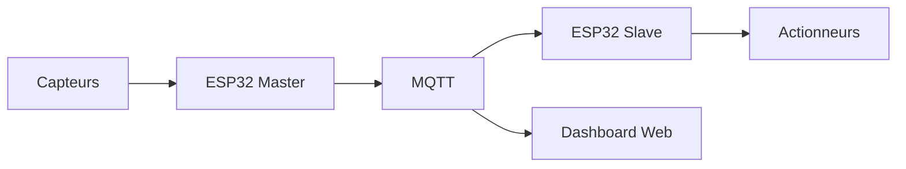

## 15. Conseils D'utilisation

- Pour la presentation, utilise surtout les diagrammes 1, 4, 7 et 13.
- Pour le cahier des charges, utilise les diagrammes 2, 8, 10 et 11.
- Pour expliquer rapidement le projet, utilise le diagramme 14.
- Pour expliquer MQTT, utilise le diagramme 4.
- Pour expliquer la reaction automatique, utilise le diagramme 7.

## 16. Diagrammes Les Plus Importants

Si tu veux rester minimal, garde seulement :

1. **Diagramme bloc simple**.
2. **Topics MQTT**.
3. **Logique automatique**.
4. **Demonstration**.

Ces quatre diagrammes suffisent pour une presentation claire.
